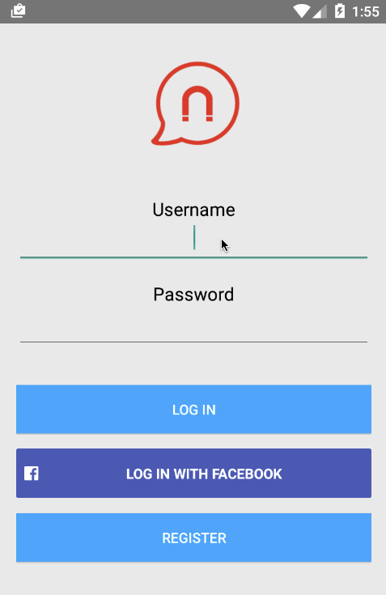

# Magnet Message Android Sample Apps

Magnet Message is a powerful, open source mobile messaging framework enabling real-time user engagement for your mobile apps. Send relevant and targeted communications to customers or employees. These sample Android apps serve as introductory sample code - get familiar with our API, extend our samples and get coding today.

## Rich Messaging

We created a simple Android chat app to demonstrate how rich content such as images, videos, and geographical location can be delivered and received using Magnet Message. This app also demonstrates Facebook integration with Magnet Message. 

## Features

* Registration and login through Magnet Message
* Login with Facebook 
* Obtain a list of users to chat with
* One to one chat with a user
* Send and receive text, pictures, videos, or a map pointing out your current location
* Receive notifications from other users which show up in your notification bar

## Video Walkthrough

