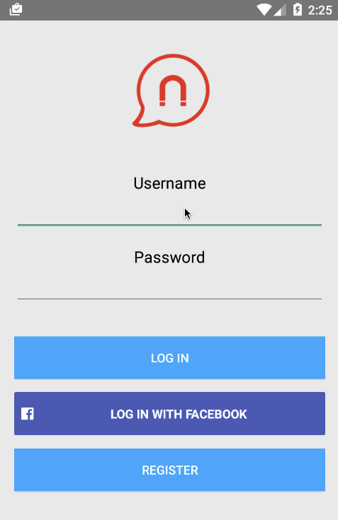

# Magnet Message Android Sample Apps

Magnet Message is a powerful, open source mobile messaging framework enabling real-time user engagement for your mobile apps. Send relevant and targeted communications to customers or employees. These sample Android apps serve as introductory sample code - get familiar with our API, extend our samples and get coding today.

## Rich Messaging

We created a simple Android chat app to demonstrate how rich content such as images, videos, and geographical location can be delivered and received using Magnet Message. Images and videos are uploaded to Amazon S3, and the URL to the file is delivered to the recipient. This app also demonstrates Facebook integration with Magnet Message. 

## Features

* Registration and login through Magnet Message
* Login with Facebook 
* Obtain a list of users to chat with
* One to one chat with a user
* Send and receive text, pictures, videos, or a map pointing out your current location
* Select and upload images and video (via Amazon S3) to be viewed by your recipient
* Obtain your current geographical location, and send the coordinates to your receipient to be viewed as a map
* Receive notifications from other users which show up in your notification bar

## Video Walkthrough

## Installation

Since this app uses Facebook for Android, you will need to follow the instructions on the [Facebook Developer Getting Started](https://developers.facebook.com/docs/android/getting-started/) page to configure the Rich Messaging app to use your own Facebook developer account. In summary, you will need to create a Facebook app, import your own `facebook_app_id` into the Rich Messaging app, and set up the Development Key Hash for your development machine at Facebook.

## How To Use

1. Enable GPS on your emulator or mobile device.
2. From the Login screen, type in a username and password, and click `Register`. Otherwise, log in with Facebook.
3. From the User Select screen, select a user to chat with. You can select your own username or `echo_bot` to send messages to yourself. 
4. From the Rich Messaging screen, try sending all the different types of rich content.